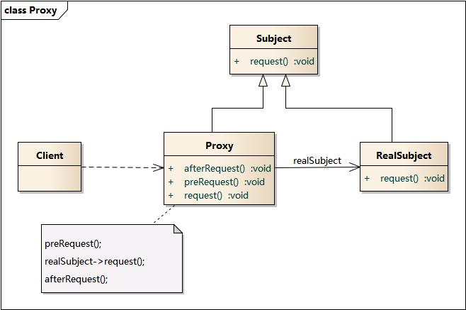

## 代理模式

### 6.1. 模式动机

在某些情况下，一个客户不想或者不能直接引用一个对 象，此时可以通过一个称之为“代理”的第三者来实现 间接引用。代理对象可以在客户端和目标对象之间起到 中介的作用，并且可以通过代理对象去掉客户不能看到 的内容和服务或者添加客户需要的额外服务。

通过引入一个新的对象（如小图片和远程代理 对象）来实现对真实对象的操作或者将新的对 象作为真实对象的一个替身，这种实现机制即 为代理模式，通过引入代理对象来间接访问一 个对象，这就是代理模式的模式动机。

### 6.2. 模式定义

代理模式(Proxy Pattern) ：给某一个对象提供一个代 理，并由代理对象控制对原对象的引用。代理模式的英 文叫做Proxy或Surrogate，它是一种对象结构型模式。

### 6.3. 模式结构

代理模式包含如下角色：

- Subject: 抽象主题角色
- Proxy: 代理主题角色
- RealSubject: 真实主题角色



### 6.3. 代码实现

```
package proxy

type Subject interface {
   Do() string
}

type RealSubject struct{}

func (RealSubject) Do() string {
   return "real"
}

type Proxy struct {
   real RealSubject
}

func (p Proxy) Do() string {
   var res string

   // 在调用真实对象之前的工作，检查缓存，判断权限，实例化真实对象等。。
   res += "pre:"

   // 调用真实对象
   res += p.real.Do()

   // 调用之后的操作，如缓存结果，对结果进行处理等。。
   res += ":after"

   return res
}
```

```
package proxy

import "testing"

func TestProxy(t *testing.T) {
   var sub Subject
   sub = &Proxy{}

   res := sub.Do()

   if res != "pre:real:after" {
      t.Fail()
   }
}
```

