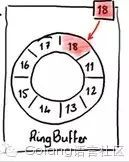
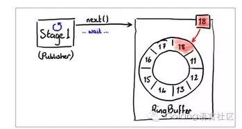
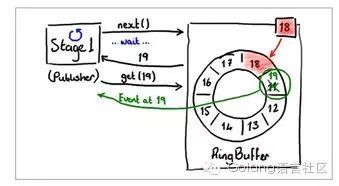
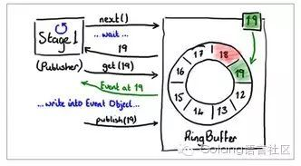

# 一种高效无锁内存队列的实现

Disruptor是LMAX公司开源的一个高效的内存无锁队列。这两天看了一下相关的设计文档和博客，下面尝试进行一下总结。

**第一部分。引子** 谈到并发程序设计，有几个概念是避免不了的。

**1.锁**：锁是用来做并发最简单的方式，当然其代价也是最高的。内核态的锁的时候需要操作系统进行一次上下文切换，等待锁的线程会被挂起直至锁释放。在上下文切换的时候，cpu之前缓存的指令和数据都将失效，对性能有很大的损失。用户态的锁虽然避免了这些问题，但是其实它们只是在没有真实的竞争时才有效。下面是一个计数实验中不加锁、使用锁、使用CAS及定义volatile变量之间的性能对比。

**2. CAS**： CAS的涵义不多介绍了。使用CAS时不像上锁那样需要一次上下文切换，但是也需要处理器锁住它的指令流水线来保证原子性，并且还要加上Memory Barrier来保证其结果可见。

**3. Memory Barrier**: 大家都知道现代CPU是乱序执行的，也就是程序顺序与实际的执行顺序很可能是不一致的。在单线程执行时这不是个问题，但是在多线程环境下这种乱序就可能会对执行结果产生很大的影响了。memory barrier提供了一种控制程序执行顺序的手段, 关于其更多介绍，可以参考 http://en.wikipedia.org/wiki/Memory_barrier

**4. Cache Line**：cache line解释起来其实很简单，就是CPU在做缓存的时候有个最小缓存单元，在同一个单元内的数据被同时被加载到缓存中，充分利用 cache line可以大大降低数据读写的延迟，错误利用cache line也会导致缓存不同替换，反复失效。

好，接下来谈一谈设计并发内存队列时需要考虑的问题。一就是数据结构的问题，是选用定长的数组还是可变的链表，二是并发控问题，是使用锁还是CAS操作，是使用粗粒度的一把锁还是将队列的头、尾、和容量三个变量分开控制，即使分开，能不能避免它们落入同一个Cache line中呢。 我们再回过头来思考一下队列的使用场景。通常我们的处理会形成一条流水线或者图结构，队列被用来作为这些流程中间的衔接表示它们之间的依赖关系，同时起到一个缓冲的作用。但是使用队列并不是没有代价的，实际上数据的入队和出队都是很耗时的，尤其在性能要求极高的场景中，这种消耗更显得奢侈。如果这种依赖能够不通过在各个流程之间放一个队列来表示那就好啦！ **第二部分 正文** 现在开始来介绍我们的Disruptor啦，有了前面这么多的铺垫，我想可以直入主题了。接下来我们就从队列的三种基本问题来细细分析下disruptor吧。

**1.列队中的元素如何存储？** Disruptor的中心数据结构是一个基于定长数组的环形队列，如图1。 在数组创建时可以预先分配好空间，插入新元素时只要将新元素数据拷贝到已经分配好的内存中即可。对数组的元素访问对CPU cache 是非常友好的。关于数组的大小选择有一个讲究，大家都知道环形队列中会用到取余操作， 在大部分处理器上，取余操作并不高效。因此可以将数组大小设定为2的指数倍，这样计算余数只需要通过位操作 index & ( size -1 )就能够得到实际的index。 Disruptor对外只有一个变量，那就是队尾元素的下标：cursor，这也避免了对head/tail这两个变量的操作和协同。生产者和消费者对disruptor的访问分别需要通过producer barrier和consumer barrier来协调。关于这两个barrier是啥，后面会介绍。



图1. RingBuffer,当前的队尾元素位置为18

**2.生产者如何向队列中插入元素？** 生产者插入元素分为两个步骤，第一步申请一个空的slot, 每个slot只会被一个生产者占用，申请到空的slot的生产者将新元素的数据拷贝到该slot；第二步是发布，发布之后，新元素才能为消费者所见。如果只有一个生产者，第一步申请操作无需同步即可完成。如果有多个生产者，那么会有一个变量：claimSequence来记录申请位置，申请操作需要通过CAS来同步，例如图二中，如果两个生产者都想申请第19号slot, 则它们会同时执行CAS(&claimSequence, 18, 19)，执行成功的人得到该slot，另一个则需要继续申请下一个可用的slot。在disruptor中，发布成功的顺序与申请的顺序是严格保持一致的，在实现上，发布事件实际上就是修改cursor的值，操作等价于CAS(&cursor, myslot-1, myslot)，从此操作也可以看出，发布执行成功的顺序必定是slot, slot 1, slot 2 ….严格有序的。另外，为了防止生产者生产过快，在环形队列中覆盖消费者的数据，生产者要对消费者的消费情况进行跟踪，实现上就是去读取一下每个消费者当前的消费位置。例如一个环形队列的大小是8，有两个消费者的分别消费到第13和14号元素，那么生产者生产的新元素是不能超过20的。插入元素的过程图示如下：



图2. RingBuffer当前的队尾位置序号为18.生产者提出申请。



图3. 生产者申请得到第19号位置，并且19号位置是独占的，可以写入生产元素。此时19号元素对消费者是不可见的。



图4，生产者成功写入19号位置后，将cursor修改为19，从而完成发布，之后消费者可以消费19号元素。

**3.消费者如何获知有新的元素进来了？** 消费者需要等待有新元素进入方能继续消费，也就是说cursor大于自己当前的消费位置。等待策略有多种。可以选择sleep wait, busy spin等等，在使用disruptor时，可以根据场景选择不同的等待策略。

**4.批量** 如果消费者发现cursor相比其最后的一次消费位置前进了不止一个位置，它就可以选择批量消费这区段的元素，而不是一次一个的向前推进。这种做法在提高吞吐量的同时还可以使系统的延迟更加平滑。

**5.依赖图** 前面也提过，在传统的系统中，通常使用队列来表示多个处理流程之间的依赖，并且一步依赖就需要多添加一个队列。在Disruptor中，由于生产者和消费者是分开考虑和控制的，因此有可能能够通过一个核心的环形队列来表示全部的依赖关系，可以大大提高吞吐，降低延迟。当然，要达到这个目的，还需要用户细心地去设计。下面举一个简单的例子来说明如何使用disruptor来表示依赖关系。

```javascript
/**
* 场景描述：生产者p1生产出来的数据需要经过消费者ep1和ep2的处理，然后传递给消费者ep3
*
*            -----
*     ----->| EP1 |------
*    |       -----       |
*    |                   v
*  ----                -----
* | P1 |              | EP3 |
*  ----                -----
*    |                   ^
*    |       -----       |
*     ----->| EP2 |------
*            -----
*
*
* 基于队列的解决方案
* ============
*                 take       put
*     put    ====      -----      ====   take
*     ----->| Q1 |<---| EP1 |--->| Q3 |<------
*    |       ====      -----      ====        |
*    |                                        |
*  ----      ====      -----      ====      -----
* | P1 |--->| Q2 |<---| EP2 |--->| Q4 |<---| EP3 |
*  ----      ====      -----      ====      -----
*
* 使用Disruptor的解决方案:
* 以一个RingBuffer为中心，生产者p1生产事件写到ringbuffer中，
* 消费者ep1和ep2仅需要根据队尾位置来进行判断是否有可消费事件即可，
* 消费者ep3则需要根据消费者ep1和ep2的位置来判断是否有可消费事件。生产者需要跟踪ep3的位置，防止覆盖未消费事件。
* ==========
*                    track to prevent wrap
*               -------------------------------
*              |                               |
*              |                               v
*  ----      ====                 =====      -----
* | P1 |--->| RB |<--------------| SB2 |<---| EP3 |
*  ----      ====                 =====      -----
*      claim   ^  get               |   waitFor
*              |                    |
*            =====      -----       |
*           | SB1 |<---| EP1 |<-----
*            =====      -----       |
*              ^                    |
*              |        -----       |
*               -------| EP2 |<-----
*             waitFor   -----
*/
```

**第三部分 结束语** disruptor本身是用java写的，但是笔者认为在c 中更能体现其优点，自己也山寨了一个c 版本。在一个生产者和一个消费者的场景中测试表明，无锁队列相比有锁队列，qps有大约10倍的提升，latency更是有几百倍的提升。不管怎么样，现在大家都渐渐都这么一个意识了：锁是性能杀手。所以这些无锁的数据结构和算法，可以尝试借鉴来使用在合适的场景中。